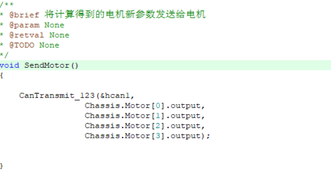

# CAN通信

main函数中会一直接受电机传回来的消息

即

只要收到的信息不为空，就会一直调用CanDataReceive函数。

与此同时，将接收到的信息放入CanReceiveData数组中去，用于接下来的解析

其中RxHeader.StdId是电调的ID号，用于区分电调。

设置电调ID方法：戳一下旁边的set键后，戳几下ID就是0x20几，若重复定义，则闪黄灯。

接下来调用CanDataReceive

若ID为0x201 （CAN_CHASSIS_MOTOR1_ID为宏定义，等于0x201）,则进行判断。刚开机时msg_cnt为0，则进入get_rotor_offset函数。该函数定义如下

可以看到，我们在解析接收到的CanReceiveData数组，来得到当前的初始转子角度位置。

而开机循环50次后，系统开始转去调用CanDataDecoder函数，用于解析得到电机传过来的各种消息。

其中的fdb即feedback，即电机反馈值。接下来将fdb值用于pid调参中获得偏差值e。

得到Chassis.Motor[0]->output

CanCommute.c中的SendMotor函数则将output值通过CAN通信发给电机。

按照通信协议要求将各部分数据改为CAN通信格式发送给电机。