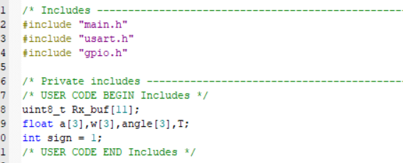

#  陀螺仪数据显示

## 实验目的：

通过串口通信函数将陀螺仪发送的数据接收到STM32中，并在调试窗口观察各数据值

## 实验所需函数：

HAL_UART_Receive_IT(&huart1,Rx_buf,11u);

void HAL_UART_RxCpltCallback(UART_HandleTypeDef *huart);

陀螺仪解码函数

## 步骤

### 1. 开启usart1中断

### 2. 打开陀螺仪使用说明，观察各数据含义以及长度

从中可知每串数据包含十一个值，故需要新建一个长度为11的数组Rx_buf[11]，用于接收数据。

### 3. 拷贝陀螺仪解码代码，粘贴在主函数内，系统将不断的接收数据

全局变量定义：

中断回调函数：

### 4. 打开调试串口观察数据

即陀螺仪的数据

